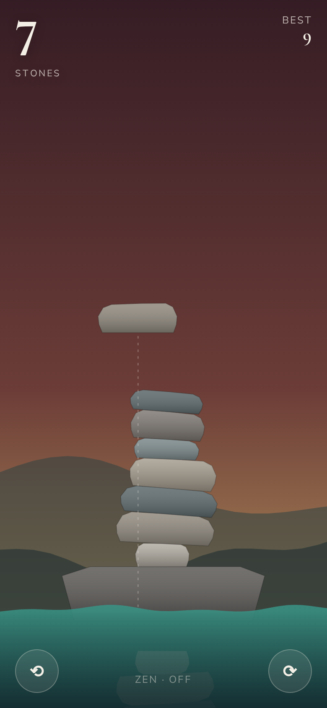
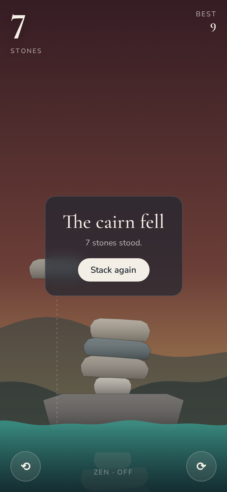

# Cairn

**Play it: [cairn.junkdrawer.works](https://cairn.junkdrawer.works/)**

**Stack river stones on a rock in a stream.** A stone swings over the pile; tap to let it go and watch it settle. Once nothing is moving, it counts and the next one comes. The pile grows, the swing gets wider and faster, and from the fifth stone the wind starts pulling at the one in your hand. One stone in the water and it's over.

<p align="center">
  
  &nbsp;
  
</p>

## How it plays

- **Tap anywhere** (or press Space) to set the stone down. The dotted line shows where it will drop.
- **⟲ and ⟳** turn the stone before you let it go, 15° a press (or the arrow keys).
- **The wind** starts at five stones: gusts come more often and blow harder the taller the cairn gets. The top-right corner shows which way it's blowing.
- **Zen** turns the wind off. A stone that falls in just washes away, and the game never ends.
- Your best is saved in your browser. No account and no server. It works offline and installs to a phone's home screen.

## Running it

It's a static site: plain HTML, CSS and JavaScript, with no build step.

```sh
npx serve .                   # or any static file server, then open the printed address
npm test                      # plays it in Chromium through the real page (needs Playwright)
node tools/screenshots.mjs    # redraws docs/*.png and og.png
node tools/make-icons.mjs     # redraws the PNG icons from icon.svg
```

To put it online with GitHub Pages: **Settings → Pages → Build and deployment → Deploy from a branch**, then pick `main` and `/ (root)`.

### Files

- `js/cairn.js`: the whole game: the rock, the stones, the rules for settling, wind and falling in, and the drawing. The physics takes fixed 60 Hz steps, so it plays at the same speed on a 120 Hz phone as on a laptop.
- `js/matter.min.js`: [matter-js](https://brm.io/matter-js/) 0.20.0, the physics engine (MIT License), served from here.
- `fonts/`: Cormorant Garamond and Nunito Sans (SIL Open Font License), served from here so nothing loads from elsewhere.
- `sw.js`: keeps a copy of the game for playing offline.
